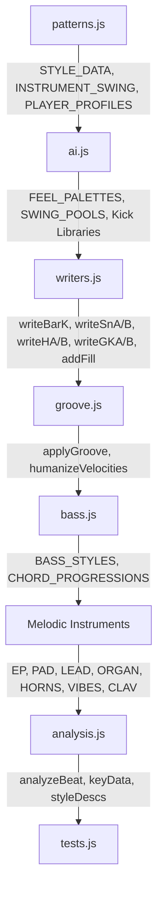

# Design Document: Seven New Styles (10 New Hip Hop Styles)

## Overview

This feature adds 10 new hip hop production styles to the beat generator, expanding from 20 base styles (plus 6 regional variants) to 30 base styles. The new styles are:

| Internal Name | UI Label | Era/Region | BPM Range |
|---|---|---|---|
| `miamibass` | Miami Bass | Miami electro bass, 1980s–90s | 125–140 |
| `nolimit` | NOLA Military | New Orleans / No Limit, late 90s | 85–100 |
| `cashmoney` | NOLA Bounce | New Orleans / Cash Money bounce | 95–110 |
| `timbaland` | Virginia Rhythm | Virginia / Timbaland-era syncopation | 90–110 |
| `neptunes` | Virginia Minimal | Virginia / Neptunes-era minimal | 85–100 |
| `ruffryder` | Raw NY | Late-90s NY / Ruff Ryders raw | 90–100 |
| `chipmunk` | Chipmunk Soul | Sped-up soul sample era | 85–95 |
| `rocafella` | Orchestral Boom Bap | Roc-A-Fella orchestral anthem | 85–100 |
| `poprap` | Pop-Rap / Radio | Clean, radio-ready pop-rap | 85–100 |
| `ratchet` | West Coast Ratchet | DJ Mustard / ratchet era | 95–105 |

All changes are purely additive — new entries in existing data structures, new branches in existing switch/if statements. No new files are created. All styles use the existing 16-step grid (16th notes per bar) with no triplet grids, trap hi-hat rolls, or time signature changes.

## Architecture

The existing architecture is a pipeline of vanilla JS modules loaded via `<script>` tags in order. Each style is defined by entries across multiple data layers:



Each new style requires entries in all layers. The `resolveBaseFeel()` function in patterns.js maps regional variants to parent feels; the 10 new styles are all base-level feels (not regional variants), so each needs its own entries everywhere.

### Key Architectural Constraint

No new files. No build step. All changes are additive entries in existing global objects and new branches in existing functions. The load order (`patterns.js` → `ai.js` → `writers.js` → `groove.js` → `bass.js` → melodic instruments → `analysis.js`) must be preserved.

## Components and Interfaces

### 1. patterns.js — Central Registry

**STYLE_DATA** — Add 10 new entries. Each entry has the shape:
```js
{ label: string, bpmRange: [min, max], bpms: number[], keys: string[], artists: string, drumKit: number, bassSound: number }
```

New entries:
```js
miamibass:  { label: 'Miami Bass',           bpmRange: [125, 140], bpms: [125,128,130,132,135,138,140], keys: ['Am','Dm','Em','Cm','Gm','Fm'],           artists: '2 Live Crew, Afro-Rican, DJ Magic Mike, Freestyle, Bass Patrol', drumKit: 25, bassSound: 38 },
nolimit:    { label: 'NOLA Military',        bpmRange: [85, 100],  bpms: [85,88,90,92,95,98,100],      keys: ['Cm','Dm','Am','Gm','Fm','Bbm'],          artists: 'Beats By the Pound, KLC, Craig B, Mo B. Dick', drumKit: 25, bassSound: 38 },
cashmoney:  { label: 'NOLA Bounce',          bpmRange: [95, 110],  bpms: [95,98,100,105,108,110],      keys: ['Gm','Cm','Dm','Am','Bb','F'],            artists: 'Mannie Fresh, DJ Jubilee, DJ Jimi', drumKit: 25, bassSound: 38 },
timbaland:  { label: 'Virginia Rhythm',      bpmRange: [90, 110],  bpms: [90,92,95,98,100,105,110],    keys: ['Cm','Dm','Am','Gm','Fm','Em'],           artists: 'Timbaland, Scott Storch (VA era)', drumKit: 16, bassSound: 34 },
neptunes:   { label: 'Virginia Minimal',     bpmRange: [85, 100],  bpms: [85,88,90,92,95,98,100],      keys: ['Am','Dm','Em','Cm','Gm'],                artists: 'The Neptunes, Chad Hugo, Pharrell', drumKit: 16, bassSound: 34 },
ruffryder:  { label: 'Raw NY',               bpmRange: [90, 100],  bpms: [90,92,95,98,100],            keys: ['Cm','Dm','Am','Fm','Gm','Bbm'],          artists: 'Swizz Beatz, PK, Dame Grease', drumKit: 16, bassSound: 34 },
chipmunk:   { label: 'Chipmunk Soul',        bpmRange: [85, 95],   bpms: [85,88,90,92,95],             keys: ['Dm','Am','Cm','Gm','Em','Fm'],           artists: 'Kanye West (early), Just Blaze, 9th Wonder', drumKit: 0, bassSound: 33 },
rocafella:  { label: 'Orchestral Boom Bap',  bpmRange: [85, 100],  bpms: [85,88,90,92,95,98,100],      keys: ['Cm','Dm','Am','Gm','Fm','Bbm'],          artists: 'Just Blaze, Kanye West, Bink!', drumKit: 0, bassSound: 33 },
poprap:     { label: 'Pop-Rap / Radio',      bpmRange: [85, 100],  bpms: [85,88,90,92,95,98,100],      keys: ['Am','Dm','Cm','Gm','C','G','Em'],        artists: 'Ryan Leslie, Polow da Don, Cool & Dre', drumKit: 16, bassSound: 38 },
ratchet:    { label: 'West Coast Ratchet',   bpmRange: [95, 105],  bpms: [95,98,100,102,105],          keys: ['Am','Dm','Em','Cm','Gm'],                artists: 'DJ Mustard, YG, Ty Dolla $ign', drumKit: 25, bassSound: 38 }
```

**INSTRUMENT_SWING** — Add 10 new entries. Each has shape `{ hat, kick, ghostSnare, backbeat, bass }` with values 0.5–1.5:
```js
miamibass:  { hat: 0.6,  kick: 0.5,  ghostSnare: 0.5,  backbeat: 0.5,  bass: 0.5 },
nolimit:    { hat: 0.8,  kick: 0.6,  ghostSnare: 0.7,  backbeat: 0.7,  bass: 0.6 },
cashmoney:  { hat: 1.15, kick: 0.7,  ghostSnare: 0.9,  backbeat: 0.8,  bass: 0.8 },
timbaland:  { hat: 0.9,  kick: 0.7,  ghostSnare: 0.8,  backbeat: 0.8,  bass: 0.7 },
neptunes:   { hat: 0.7,  kick: 0.55, ghostSnare: 0.6,  backbeat: 0.6,  bass: 0.55 },
ruffryder:  { hat: 0.7,  kick: 0.55, ghostSnare: 0.6,  backbeat: 0.6,  bass: 0.55 },
chipmunk:   { hat: 1.1,  kick: 0.8,  ghostSnare: 1.0,  backbeat: 0.9,  bass: 0.9 },
rocafella:  { hat: 1.0,  kick: 0.75, ghostSnare: 0.9,  backbeat: 0.85, bass: 0.85 },
poprap:     { hat: 0.7,  kick: 0.55, ghostSnare: 0.6,  backbeat: 0.6,  bass: 0.55 },
ratchet:    { hat: 0.6,  kick: 0.5,  ghostSnare: 0.5,  backbeat: 0.5,  bass: 0.5 }
```

**PLAYER_PROFILES** — Alias new styles to existing profiles where humanization characteristics match:
```js
PLAYER_PROFILES.miamibass = PLAYER_PROFILES.oldschool;   // machine-driven, mechanical
PLAYER_PROFILES.nolimit = PLAYER_PROFILES.hard;          // tight, aggressive
PLAYER_PROFILES.cashmoney = PLAYER_PROFILES.normal;      // funky, groovy
PLAYER_PROFILES.timbaland = PLAYER_PROFILES.hard;        // precise, controlled
PLAYER_PROFILES.neptunes = PLAYER_PROFILES.oldschool;    // minimal, precise
PLAYER_PROFILES.ruffryder = PLAYER_PROFILES.hard;        // raw, aggressive
PLAYER_PROFILES.chipmunk = PLAYER_PROFILES.normal;       // boom bap foundation
PLAYER_PROFILES.rocafella = PLAYER_PROFILES.normal;      // boom bap with anthem energy
PLAYER_PROFILES.poprap = PLAYER_PROFILES.oldschool;      // clean, radio-ready
PLAYER_PROFILES.ratchet = PLAYER_PROFILES.crunk;         // mechanical, formulaic
```


### 2. ai.js — Generation Engine

**FEEL_PALETTES** — Add 10 new entries, each `[verse, chorus, breakdown, pre]`:
```js
['miamibass', 'big', 'sparse', 'driving'],
['nolimit', 'hard', 'dark', 'driving'],
['cashmoney', 'big', 'bounce', 'driving'],
['timbaland', 'big', 'dark', 'driving'],
['neptunes', 'big', 'sparse', 'driving'],
['ruffryder', 'hard', 'dark', 'driving'],
['chipmunk', 'big', 'sparse', 'normal'],
['rocafella', 'big', 'dark', 'driving'],
['poprap', 'big', 'sparse', 'driving'],
['ratchet', 'big', 'hard', 'driving'],
```

**SWING_POOLS** — Add 10 new entries, each an array of 7–11 weighted swing percentages:
```js
miamibass:  [50, 50, 52, 52, 52, 54, 54],           // nearly straight, machine-driven
nolimit:    [54, 56, 56, 58, 58, 60, 60],           // tight, military
cashmoney:  [62, 64, 64, 66, 66, 68, 68],           // second-line bounce
timbaland:  [56, 58, 58, 60, 60, 62, 62],           // syncopated but controlled
neptunes:   [52, 54, 54, 56, 56, 58, 58],           // minimal, precise
ruffryder:  [52, 54, 54, 56, 56, 58, 58],           // raw, mechanical
chipmunk:   [60, 62, 62, 64, 64, 66, 66, 68],       // boom bap swing
rocafella:  [58, 60, 60, 62, 62, 64, 64],           // punchy, anthem
poprap:     [52, 54, 54, 56, 56, 58, 58],           // clean, radio-ready
ratchet:    [50, 50, 52, 52, 54, 54, 56],           // straight, formulaic
```

**Kick Libraries** — Add 10 new curated libraries in `genBasePatterns()`. Each library is 8–12 patterns of 16-element binary arrays. Selection logic follows the existing `oldschoolKickLib` / `detroitKickLib` pattern: check `paletteFeel0` and pick from the style-specific library.

#### Kick Library Specifications

**miamibass** (10 patterns) — Four-on-the-floor dominant, electro bass:
```js
var miamiKickLib = [
  [1,0,0,0, 1,0,0,0, 1,0,0,0, 1,0,0,0],  // four-on-the-floor — classic electro
  [1,0,0,0, 1,0,0,0, 1,0,0,0, 1,0,1,0],  // four-on-the-floor + and-of-4
  [1,0,1,0, 1,0,0,0, 1,0,0,0, 1,0,0,0],  // double on 1, then straight
  [1,0,0,0, 1,0,0,0, 1,0,1,0, 1,0,0,0],  // double on 3
  [1,0,0,0, 1,0,1,0, 1,0,0,0, 1,0,0,0],  // double on 2
  [1,0,0,0, 1,0,0,0, 1,0,0,0, 1,0,0,1],  // four-on-floor + ah-of-4
  [1,0,1,0, 1,0,0,0, 1,0,1,0, 1,0,0,0],  // doubles on 1 and 3
  [1,0,0,0, 1,0,0,0, 1,0,0,1, 1,0,0,0],  // four-on-floor + ah-of-3
  [1,0,0,0, 0,0,0,0, 1,0,0,0, 1,0,0,0],  // drop beat 2 — breakdown variant
  [1,0,0,0, 1,0,0,0, 1,0,0,0, 0,0,1,0],  // drop beat 4, add and-of-4
];
```

**nolimit** (10 patterns) — Sparse, heavy, military-influenced:
```js
var nolimitKickLib = [
  [1,0,0,0, 0,0,0,0, 1,0,0,0, 0,0,0,0],  // 1 and 3 — heavy and simple
  [1,0,0,0, 0,0,0,0, 0,0,1,0, 0,0,0,0],  // 1, and-of-3
  [1,0,0,0, 0,0,1,0, 1,0,0,0, 0,0,0,0],  // 1, and-of-2, 3
  [1,0,0,0, 0,0,0,0, 1,0,0,0, 0,0,1,0],  // 1, 3, and-of-4
  [1,0,0,0, 0,0,0,0, 0,0,0,0, 0,0,1,0],  // 1, and-of-4 — sparse
  [1,0,0,0, 0,0,1,0, 0,0,0,0, 0,0,0,0],  // 1, and-of-2 — minimal
  [1,0,0,0, 0,0,0,0, 1,0,0,0, 1,0,0,0],  // 1, 3, 4
  [1,0,0,0, 0,0,0,1, 1,0,0,0, 0,0,0,0],  // 1, ah-of-2, 3
  [1,0,0,0, 0,0,0,0, 0,0,0,0, 1,0,0,0],  // 1 and 4
  [1,0,0,0, 0,0,1,0, 0,0,1,0, 0,0,0,0],  // 1, and-of-2, and-of-3
];
```

**cashmoney** (10 patterns) — Syncopated, second-line bounce:
```js
var cashmoneyKickLib = [
  [1,0,0,0, 0,0,1,0, 1,0,0,0, 0,0,1,0],  // 1, and-of-2, 3, and-of-4 — rolling bounce
  [1,0,1,0, 0,0,0,0, 1,0,1,0, 0,0,0,0],  // doubles on 1 and 3
  [1,0,0,0, 0,0,1,0, 0,0,1,0, 0,0,0,0],  // 1, and-of-2, and-of-3
  [1,0,0,0, 0,0,0,0, 1,0,0,0, 0,0,1,0],  // 1, 3, and-of-4
  [1,0,1,0, 0,0,1,0, 1,0,0,0, 0,0,0,0],  // busy front half
  [1,0,0,0, 0,0,1,0, 0,0,0,0, 1,0,0,0],  // 1, and-of-2, 4
  [1,0,0,0, 1,0,0,0, 1,0,0,0, 0,0,1,0],  // 1, 2, 3, and-of-4
  [1,0,0,0, 0,0,1,0, 1,0,1,0, 0,0,0,0],  // 1, and-of-2, 3, and-of-3
  [1,0,0,0, 0,0,0,0, 0,0,1,0, 0,0,1,0],  // 1, and-of-3, and-of-4
  [1,0,1,0, 0,0,0,0, 0,0,1,0, 0,0,1,0],  // double on 1, syncopated back half
];
```

**timbaland** (10 patterns) — Unusual, inventive placements:
```js
var timbalandKickLib = [
  [1,0,0,0, 0,1,0,0, 0,0,0,0, 0,1,0,0],  // 1, e-of-2, e-of-4 — offbeat
  [1,0,0,1, 0,0,0,0, 1,0,0,1, 0,0,0,0],  // 1, ah-of-1, 3, ah-of-3
  [1,0,0,0, 0,0,0,1, 0,0,1,0, 0,0,0,0],  // 1, ah-of-2, and-of-3
  [0,0,1,0, 0,0,0,0, 1,0,0,0, 0,1,0,0],  // and-of-1, 3, e-of-4 — displaced
  [1,0,0,0, 0,0,1,0, 0,1,0,0, 0,0,0,0],  // 1, and-of-2, e-of-3
  [1,0,0,0, 0,0,0,0, 0,0,0,1, 0,0,1,0],  // 1, ah-of-3, and-of-4
  [1,1,0,0, 0,0,0,0, 0,0,1,0, 0,0,0,1],  // double on 1, and-of-3, ah-of-4
  [1,0,0,0, 0,0,0,0, 1,0,0,0, 0,0,0,0],  // simple 1 and 3 — contrast bar
  [0,0,0,1, 0,0,1,0, 0,0,0,0, 0,0,0,1],  // ah-of-1, and-of-2, ah-of-4
  [1,0,0,0, 0,1,0,0, 1,0,0,0, 0,0,1,0],  // 1, e-of-2, 3, and-of-4
];
```

**neptunes** (8 patterns) — Minimal, deliberate spacing:
```js
var neptunesKickLib = [
  [1,0,0,0, 0,0,0,0, 1,0,0,0, 0,0,0,0],  // 1 and 3 — classic minimal
  [1,0,0,0, 0,0,0,0, 0,0,0,0, 0,0,0,0],  // kick on 1 only — ultra minimal
  [1,0,0,0, 0,0,1,0, 0,0,0,0, 0,0,0,0],  // 1, and-of-2
  [1,0,0,0, 0,0,0,0, 0,0,1,0, 0,0,0,0],  // 1, and-of-3
  [1,0,0,0, 0,0,0,0, 1,0,0,0, 0,0,1,0],  // 1, 3, and-of-4
  [0,0,1,0, 0,0,0,0, 1,0,0,0, 0,0,0,0],  // and-of-1, 3 — displaced
  [1,0,0,0, 0,0,0,0, 0,0,0,0, 1,0,0,0],  // 1 and 4
  [1,0,0,0, 0,0,0,0, 0,0,0,0, 0,0,1,0],  // 1, and-of-4
];
```

**ruffryder** (10 patterns) — Simple, aggressive:
```js
var ruffryderKickLib = [
  [1,0,0,0, 0,0,0,0, 1,0,0,0, 0,0,0,0],  // 1 and 3 — raw and simple
  [1,0,0,0, 0,0,1,0, 1,0,0,0, 0,0,0,0],  // 1, and-of-2, 3
  [1,0,0,0, 0,0,0,0, 1,0,0,0, 0,0,1,0],  // 1, 3, and-of-4
  [1,0,0,0, 0,0,1,0, 0,0,0,0, 0,0,1,0],  // 1, and-of-2, and-of-4
  [1,0,0,0, 0,0,0,0, 1,0,1,0, 0,0,0,0],  // 1, 3, and-of-3
  [1,1,0,0, 0,0,0,0, 1,0,0,0, 0,0,0,0],  // double on 1, 3
  [1,0,0,0, 0,0,1,0, 1,0,0,0, 0,0,1,0],  // rolling — 1, and-of-2, 3, and-of-4
  [1,0,0,0, 1,0,0,0, 1,0,0,0, 0,0,0,0],  // 1, 2, 3 — aggressive
  [1,0,0,0, 0,0,0,0, 0,0,1,0, 0,0,0,0],  // 1, and-of-3
  [1,0,0,0, 0,0,0,0, 1,0,0,0, 1,0,0,0],  // 1, 3, 4
];
```

**chipmunk** (10 patterns) — Standard boom bap vocabulary:
```js
var chipmunkKickLib = [
  [1,0,0,0, 0,0,1,0, 1,0,0,0, 0,0,0,0],  // classic boom bap
  [1,0,0,0, 0,0,1,0, 0,0,1,0, 0,0,0,0],  // chopped
  [1,0,0,0, 0,0,0,0, 1,0,0,0, 0,0,0,0],  // 1 and 3
  [1,0,1,0, 0,0,0,0, 1,0,0,0, 0,0,0,0],  // double on 1, 3
  [1,0,0,0, 0,0,1,0, 1,0,0,0, 0,0,1,0],  // rolling
  [1,0,0,0, 0,0,0,0, 1,0,1,0, 0,0,0,0],  // 1, 3, and-of-3
  [1,0,0,0, 0,0,1,0, 0,0,0,0, 0,0,0,0],  // 1, and-of-2 — minimal
  [1,0,0,0, 0,0,0,0, 0,0,1,0, 0,0,1,0],  // 1, and-of-3, and-of-4
  [1,0,0,0, 0,0,1,0, 1,0,1,0, 0,0,0,0],  // busy — 1, and-of-2, 3, and-of-3
  [1,0,0,0, 0,0,0,0, 1,0,0,0, 0,0,1,0],  // 1, 3, and-of-4
];
```

**rocafella** (10 patterns) — Heavy doubles, dense, anthem:
```js
var rocafellaKickLib = [
  [1,1,0,0, 0,0,1,0, 1,0,0,0, 0,0,0,0],  // double on 1, and-of-2, 3
  [1,0,0,0, 0,0,1,0, 1,1,0,0, 0,0,0,0],  // 1, and-of-2, double on 3
  [1,1,0,0, 0,0,0,0, 1,1,0,0, 0,0,0,0],  // doubles on 1 and 3
  [1,0,0,0, 0,0,1,0, 1,0,0,0, 0,0,1,0],  // rolling — 1, and-of-2, 3, and-of-4
  [1,1,0,0, 0,0,1,0, 1,0,0,0, 0,0,1,0],  // double on 1, rolling back
  [1,0,0,0, 0,0,1,0, 1,0,1,0, 0,0,0,0],  // 1, and-of-2, 3, and-of-3
  [1,1,1,0, 0,0,0,0, 1,0,0,0, 0,0,0,0],  // triple on 1, 3
  [1,0,0,0, 0,0,1,0, 0,0,1,0, 0,0,1,0],  // 1, syncopated back half
  [1,1,0,0, 0,0,0,0, 1,0,0,0, 0,0,1,0],  // double on 1, 3, and-of-4
  [1,0,0,0, 0,0,1,0, 1,0,0,0, 1,0,0,0],  // 1, and-of-2, 3, 4
];
```

**poprap** (8 patterns) — Clean, simple:
```js
var poprapKickLib = [
  [1,0,0,0, 0,0,0,0, 1,0,0,0, 0,0,0,0],  // 1 and 3 — clean
  [1,0,0,0, 0,0,1,0, 1,0,0,0, 0,0,0,0],  // 1, and-of-2, 3
  [1,0,0,0, 0,0,0,0, 1,0,0,0, 0,0,1,0],  // 1, 3, and-of-4
  [1,0,0,0, 0,0,1,0, 0,0,0,0, 0,0,0,0],  // 1, and-of-2
  [1,0,0,0, 0,0,0,0, 0,0,1,0, 0,0,0,0],  // 1, and-of-3
  [1,0,0,0, 1,0,0,0, 1,0,0,0, 0,0,0,0],  // 1, 2, 3
  [1,0,0,0, 0,0,1,0, 1,0,0,0, 0,0,1,0],  // rolling
  [1,0,0,0, 0,0,0,0, 1,0,0,0, 1,0,0,0],  // 1, 3, 4
];
```

**ratchet** (8 patterns) — Minimal, formulaic:
```js
var ratchetKickLib = [
  [1,0,0,0, 0,0,0,0, 1,0,0,0, 0,0,0,0],  // 1 and 3 — Mustard classic
  [1,0,0,0, 0,0,0,0, 0,0,1,0, 0,0,0,0],  // 1, and-of-3
  [1,0,0,0, 0,0,1,0, 0,0,0,0, 0,0,0,0],  // 1, and-of-2
  [1,0,0,0, 0,0,0,0, 1,0,0,0, 0,0,1,0],  // 1, 3, and-of-4
  [1,0,0,0, 0,0,0,0, 0,0,0,0, 0,0,1,0],  // 1, and-of-4
  [1,0,0,0, 0,0,1,0, 1,0,0,0, 0,0,0,0],  // 1, and-of-2, 3
  [1,0,0,0, 0,0,0,0, 1,0,0,0, 1,0,0,0],  // 1, 3, 4
  [1,0,0,0, 0,0,0,0, 0,0,1,0, 0,0,1,0],  // 1, and-of-3, and-of-4
];
```


### 3. bass.js — Bass Behavior

**BASS_STYLES** — Add 10 new entries. Each has the full parameter set matching the existing shape. Key design decisions per style:

| Style | instrument | rhythm | density | velBase | subSwell | Key Character |
|---|---|---|---|---|---|---|
| miamibass | 808sub | quarter | 1.0 | 120 | 0.3 | Sustained 808, long notes, minimal movement |
| nolimit | 808sub | kick | 0.85 | 115 | 0.2 | Heavy 808, follows kick, occasional slide |
| cashmoney | 808sub | kick | 0.9 | 110 | 0.15 | Bouncy 808, moderate movement |
| timbaland | bassguitar | kick | 0.85 | 100 | 0.0 | Syncopated bass guitar, moderate articulation |
| neptunes | bassguitar | kick | 0.7 | 95 | 0.0 | Minimal bass, sparse, deliberate |
| ruffryder | bassguitar | kick | 0.95 | 110 | 0.0 | Aggressive bass, short notes, punchy |
| chipmunk | bassguitar | kick | 0.9 | 100 | 0.0 | Soul-sample bass, moderate walk, warm |
| rocafella | bassguitar | kick | 0.9 | 105 | 0.0 | Punchy bass, moderate articulation |
| poprap | 808sub | kick | 0.85 | 100 | 0.1 | Clean 808, moderate sustain |
| ratchet | 808sub | kick | 0.7 | 115 | 0.25 | Minimal 808, long sustain, sparse |

**CHORD_PROGRESSIONS** — Add 10 new entries, each with 3–6 progression patterns of 8 chords:

```js
miamibass:  [['i','i','i','i','i','i','i','i'], ['i','i','i','iv','i','i','i','iv'], ['i','i','i','i','i','i','i','bVII']],
nolimit:    [['i','i','i','i','i','i','i','i'], ['i','i','iv','i','i','i','iv','i'], ['i','i','i','iv','i','i','i','iv'], ['i','bVII','i','i','i','bVII','i','i']],
cashmoney:  [['i','iv','i','v','i','iv','i','v'], ['i','i','iv','i','i','i','iv','i'], ['i','iv','iv','v','i','iv','iv','v'], ['i','bVII','iv','i','i','bVII','iv','i']],
timbaland:  [['i','i','iv','i','i','i','iv','i'], ['i','i','i','iv','i','i','i','iv'], ['i','iv','i','v','i','iv','i','v'], ['i','bVII','i','iv','i','bVII','i','iv']],
neptunes:   [['i','i','i','i','i','i','i','i'], ['i','i','iv','i','i','i','iv','i'], ['i','iv','i','i','i','iv','i','i']],
ruffryder:  [['i','i','i','i','i','i','i','i'], ['i','i','iv','i','i','i','iv','i'], ['i','i','bII','i','i','i','bII','i'], ['i','i','i','iv','i','i','i','iv']],
chipmunk:   [['i','iv','i','v','i','iv','i','v'], ['i','i','iv','v','i','i','iv','v'], ['i','iv','iv','i','i','iv','iv','i'], ['i','bVII','iv','i','i','bVII','iv','i'], ['i','iv','i','bVI','i','iv','i','bVI']],
rocafella:  [['i','iv','i','v','i','iv','i','v'], ['i','i','iv','v','i','i','iv','v'], ['i','iv','v','i','i','iv','v','i'], ['i','bVII','iv','v','i','bVII','iv','v'], ['i','iv','i','bVI','i','iv','i','bVI']],
poprap:     [['i','iv','i','v','i','iv','i','v'], ['i','i','iv','i','i','i','iv','i'], ['i','iv','v','i','i','iv','v','i'], ['i','bVII','iv','i','i','bVII','iv','i']],
ratchet:    [['i','i','i','i','i','i','i','i'], ['i','i','i','iv','i','i','i','iv'], ['i','i','i','i','i','i','i','bVII']],
```

### 4. writers.js — Bar Writer Modifications

Each bar writer function uses `feel` parameter in if/else chains. New styles need branches where their behavior differs from the default path. The design principle: if a new style's behavior matches an existing feel's branch, no new branch is needed (it falls through to default). Only add branches for distinctive behavior.

**writeBarK** — Kick velocity scaling. New branches needed:
- `miamibass`: High velocity (115 base), tight range — machine-driven
- `nolimit`: High velocity (112 base), moderate range
- `ruffryder`: High velocity (115 base), minimal range — raw and punchy
- `ratchet`: Moderate velocity (105 base), tight range
- Others fall through to default or match existing branches

**writeSnA / writeSnB** — Snare and ghost patterns:
- `neptunes`: Primary snare may land on step 6 (and-of-2) instead of step 4 (beat 2) with ~30% probability
- `nolimit`: Ghost note clusters (steps 1, 3 around backbeat) to simulate military snare roll influence
- `rocafella`: Flam-like ghost note at step 3 (ah-of-1) before backbeat at step 4, ~40% probability
- Others use default snare behavior

**writeHA / writeHB** — Hi-hat patterns:
- `miamibass`: Open hat on upbeat positions (steps 2, 6, 10, 14) — electro bass signature
- `timbaland`: Unusual accent placements — accent on steps 3, 7, 11 (ah positions) instead of downbeats
- `neptunes`: Sparse hats — only on downbeats (steps 0, 4, 8, 12), very quiet
- `ratchet`: Standard 8th notes but with rest on step 8 (beat 3) — the Mustard gap
- Others use default hat behavior

**writeGKA / writeGKB** — Ghost kick:
- `miamibass`, `ratchet`: No ghost kicks (machine-driven styles)
- Others use default ghost kick behavior

**addFill** — Section-ending fills:
- `miamibass`: Snare roll fills (rapid 16th notes on snare, steps 12–15)
- `nolimit`: Military-style snare roll fills
- `ratchet`: Minimal fills — just a single snare hit on step 15
- Others use default fill behavior

**writeCowbell** — Add `miamibass` to the cowbell function:
- Miami bass uses cowbell patterns (8th notes, accented on downbeats)

### 5. Melodic Instrument Flags

Add entries to the boolean style maps in each melodic instrument file:

| Style | EP | PAD | LEAD | ORGAN | HORNS | VIBES | CLAV |
|---|---|---|---|---|---|---|---|
| miamibass | - | ✓ | - | - | - | - | - |
| nolimit | - | ✓ | - | - | ✓ | - | - |
| cashmoney | ✓ | - | - | ✓ | ✓ | - | - |
| timbaland | ✓ | - | - | - | - | - | - |
| neptunes | ✓ | - | - | - | - | - | - |
| ruffryder | - | ✓ | - | - | - | - | - |
| chipmunk | ✓ | - | - | - | - | - | - |
| rocafella | ✓ | - | - | - | ✓ | - | - |
| poprap | ✓ | - | - | - | - | - | - |
| ratchet | - | ✓ | - | - | - | - | - |

Plus corresponding `EP_COMP_STYLES`, `PAD_COMP_STYLES`, `ORGAN_COMP_STYLES`, and `HORN_COMP_STYLES` entries for each enabled style.

**EP_COMP_STYLES** additions (cashmoney, timbaland, neptunes, chipmunk, rocafella, poprap):
```js
cashmoney:  { rhythm: 'comp',   velBase: 68, velRange: 14, noteDur: 0.35, density: 0.7,  register: 'mid',  voicing: 'seventh', spread: 12, behind: 1, octaveRoot: 0.2, regShift: { chorus: 'high', breakdown: 'low' } },
timbaland:  { rhythm: 'whole',  velBase: 55, velRange: 10, noteDur: 0.9,  density: 0.85, register: 'mid',  voicing: 'seventh', spread: 12, behind: 0, octaveRoot: 0.3, regShift: { chorus: 'high', breakdown: 'low' } },
neptunes:   { rhythm: 'stab',   velBase: 70, velRange: 12, noteDur: 0.25, density: 0.5,  register: 'mid',  voicing: 'triad',   spread: 10, behind: 0, octaveRoot: 0.1, regShift: { chorus: 'high', breakdown: 'mid' } },
chipmunk:   { rhythm: 'comp',   velBase: 65, velRange: 14, noteDur: 0.35, density: 0.75, register: 'high', voicing: 'seventh', spread: 12, behind: 1, octaveRoot: 0.2, regShift: { chorus: 'high', breakdown: 'mid' } },
rocafella:  { rhythm: 'comp',   velBase: 72, velRange: 12, noteDur: 0.4,  density: 0.7,  register: 'mid',  voicing: 'triad',   spread: 10, behind: 0, octaveRoot: 0.2, regShift: { chorus: 'high', breakdown: 'low' } },
poprap:     { rhythm: 'whole',  velBase: 55, velRange: 8,  noteDur: 0.85, density: 0.9,  register: 'mid',  voicing: 'seventh', spread: 12, behind: 0, octaveRoot: 0.3, regShift: { chorus: 'high', breakdown: 'mid' } },
```

**PAD_COMP_STYLES** additions (miamibass, nolimit, ruffryder, ratchet):
```js
miamibass:  { rhythm: 'stab',    velBase: 75, velRange: 12, noteDur: 0.3,  density: 0.6,  register: 'mid',  voicing: 'triad',   program: 81, detuned: false, regShift: { chorus: 'high', breakdown: 'mid' } },
nolimit:    { rhythm: 'sustain', velBase: 40, velRange: 8,  noteDur: 0.9,  density: 0.8,  register: 'low',  voicing: 'triad',   program: 48, detuned: true,  regShift: { chorus: 'mid', breakdown: 'low' } },
ruffryder:  { rhythm: 'stab',    velBase: 80, velRange: 10, noteDur: 0.25, density: 0.55, register: 'mid',  voicing: 'triad',   program: 81, detuned: false, regShift: { chorus: 'high', breakdown: 'mid' } },
ratchet:    { rhythm: 'stab',    velBase: 72, velRange: 10, noteDur: 0.2,  density: 0.45, register: 'mid',  voicing: 'triad',   program: 81, detuned: false, regShift: { chorus: 'high', breakdown: 'mid' } },
```

**ORGAN_COMP_STYLES** addition (cashmoney):
```js
cashmoney:  { velBase: 45, velRange: 10, noteDur: 0.85, density: 0.7, register: 'mid', voicing: 'triad', program: 19, regShift: { chorus: 'high', breakdown: 'mid' } },
```

**HORN_COMP_STYLES** additions (nolimit, cashmoney, rocafella):
```js
nolimit:    { velBase: 92, velRange: 8,  noteDur: 0.45, density: 0.4,  register: 'high', voicing: 'triad', program: 61 },
cashmoney:  { velBase: 88, velRange: 12, noteDur: 0.5,  density: 0.45, register: 'high', voicing: 'triad', program: 61 },
rocafella:  { velBase: 95, velRange: 10, noteDur: 0.6,  density: 0.5,  register: 'high', voicing: 'triad', program: 61 },
```

### 6. analysis.js — Analysis Content

Add to `styleNames`, `styleDescs`, `keyData`, `refMap`, `mixTips`, `sampleGuide`, `drumMachineHeritage`, and `whatWouldTheyDo` maps for all 10 new styles. Each `keyData` entry needs at least 3 key descriptions with root, type, chord numerals, relative key, and context string.

### 7. groove.js — Accent Curves

The `applyGroove` function uses feel-based if/else chains. Most new styles can fall through to default behavior. Specific additions:
- `miamibass`, `ratchet`: Flat accent curves (like crunk/oldschool) — machine-driven, no dynamic shaping
- `nolimit`: Flat accent curves similar to hard
- Others use default accent behavior

### 8. app.js — Tip Ticker

Add entries to the `styleDesc` map in `getRoleSectionTips` for all 10 new styles.

### 9. UI/Documentation Updates

- `index.html`: Update style count in welcome and about dialogs, update version strings
- `manifest.json`: Update description with new style count
- `README.md`: Update header count, add styles to highlights list, update test count
- `DOCS.md`: Update header count, add technical documentation for each style, update test count
- `CHANGELOG.md`: Add entry for new styles
- `sw.js`: Bump CACHE_NAME version
- `package.json`: Bump version
- `CONTRIBUTING.md`: Update style count if referenced


## Data Models

No new data models are introduced. All changes add entries to existing data structures. The existing shapes are preserved exactly:

### Existing Shapes (unchanged)

**STYLE_DATA entry:**
```js
{ label: string, bpmRange: [number, number], bpms: number[], keys: string[], artists: string, drumKit: number, bassSound: number }
```

**BASS_STYLES entry:**
```js
{ rhythm: string, density: number, velBase: number, velRange: number, noteDur: number,
  useFifth: number, useOctaveDrop: number, walkUp: number, slideProb: number,
  ghostNoteDensity: number, timingOffset: number, useMinor7th: number, octaveUpProb: number,
  deadNoteProb: number, walkDirection: string, walkDiatonic: number, backbeatAccent: number,
  chordAnticipation: number, subSwell: number, restProb: number, hammerOnProb: number,
  timingJitter: number, velCompression: number, energyArc: boolean, instrument: string,
  pullOffProb: number, rakeProb: number, trillProb: number, doubleStopProb: number,
  upbeatAccent: number, restBarProb: number, beat1SkipProb: number, rhythmMutate: number }
```

**CHORD_PROGRESSIONS entry:**
```js
string[][] // Array of 3-6 progressions, each an 8-element array of chord degree strings
```

**INSTRUMENT_SWING entry:**
```js
{ hat: number, kick: number, ghostSnare: number, backbeat: number, bass: number }
```

**PLAYER_PROFILES entry:**
```js
Array<{ name: string, kick: {center, jitter, tight}, snare: {center, jitter, tight},
        hat: {center, jitter, tight}, ghost: {center, jitter, tight}, ride: {center, jitter, tight} }>
```

**Kick pattern:**
```js
number[16] // 16-element binary array, each element 0 or 1
```

**Melodic instrument style flag:**
```js
{ [feelName]: true } // Boolean map — presence means enabled
```

**EP_COMP_STYLES / PAD_COMP_STYLES / HORN_COMP_STYLES / ORGAN_COMP_STYLES entries:**
Each follows the existing shape defined in its respective file (see Components section above for exact fields).

### Test Data Shape

The test file (`tests.js`) uses an `expected` array of feel name strings and iterates over `Object.keys(STYLE_DATA)` to verify completeness. The expected array grows from 20 to 30 entries.


## Correctness Properties

*A property is a characteristic or behavior that should hold true across all valid executions of a system — essentially, a formal statement about what the system should do. Properties serve as the bridge between human-readable specifications and machine-verifiable correctness guarantees.*

### Property 1: STYLE_DATA structural completeness

*For any* entry in STYLE_DATA, it SHALL have a non-empty `label` string, a `bpmRange` array of exactly 2 numbers, a `bpms` array of at least 3 numbers, a `keys` array of at least 3 strings, a non-empty `artists` string, and numeric `drumKit` and `bassSound` values.

**Validates: Requirements 1.3, 1.4, 1.5**

### Property 2: FEEL_PALETTES referential integrity

*For any* entry in FEEL_PALETTES, it SHALL contain exactly 4 strings, and every string in the palette SHALL exist as a key in SWING_POOLS.

**Validates: Requirements 2.1, 2.2**

### Property 3: SWING_POOLS minimum size

*For any* entry in SWING_POOLS, the array SHALL contain at least 5 numeric values.

**Validates: Requirements 3.1**

### Property 4: Kick pattern binary structure

*For any* kick pattern in any style-specific kick library, the pattern SHALL be an array of exactly 16 elements, and each element SHALL be either 0 or 1.

**Validates: Requirements 4.2, 14.1**

### Property 5: BASS_STYLES structural completeness

*For any* entry in BASS_STYLES, it SHALL contain all required parameter keys: rhythm, density, velBase, velRange, noteDur, useFifth, useOctaveDrop, walkUp, slideProb, ghostNoteDensity, timingOffset, useMinor7th, octaveUpProb, deadNoteProb, walkDirection, walkDiatonic, backbeatAccent, chordAnticipation, subSwell, restProb, hammerOnProb, timingJitter, velCompression, energyArc, instrument, pullOffProb, rakeProb, trillProb, doubleStopProb, upbeatAccent, restBarProb, beat1SkipProb, rhythmMutate.

**Validates: Requirements 5.1**

### Property 6: CHORD_PROGRESSIONS structure

*For any* entry in CHORD_PROGRESSIONS, it SHALL contain 3–6 progression arrays, and each progression SHALL be an array of exactly 8 string elements.

**Validates: Requirements 6.1, 6.2**

### Property 7: INSTRUMENT_SWING validity

*For any* entry in INSTRUMENT_SWING, it SHALL have all 5 required keys (hat, kick, ghostSnare, backbeat, bass), and each value SHALL be a number between 0.5 and 1.5 inclusive.

**Validates: Requirements 7.1, 7.2**

### Property 8: PLAYER_PROFILES coverage

*For any* key in STYLE_DATA, there SHALL exist a corresponding entry in PLAYER_PROFILES (either directly defined or aliased from another style).

**Validates: Requirements 8.1**

### Property 9: Generation pipeline crash-free with valid output

*For any* style in STYLE_DATA, calling `genBasePatterns()` followed by `generatePattern('verse')` SHALL complete without errors, produce a pattern object with all ROWS keys, and all velocity values SHALL be in the range [0, 127]. Additionally, `analyzeBeat()` SHALL produce a non-empty output without errors.

**Validates: Requirements 9.1, 11.3, 15.1**

### Property 10: EP/PAD mutual exclusion

*For any* style, EP_STYLES and PAD_STYLES SHALL NOT both be `true` for the same feel name.

**Validates: Requirements 10.1**

## Error Handling

This feature is purely additive data. Error handling follows existing patterns:

1. **Missing style fallback**: `resolveBaseFeel()` returns the feel unchanged if not a regional variant. `INSTRUMENT_SWING[baseFeel] || INSTRUMENT_SWING.normal` provides fallback. New styles are base-level feels, so they resolve to themselves.

2. **Bar writer fallback**: If a new feel doesn't match any specific branch in a bar writer, it falls through to the default code path (which produces valid boom bap patterns). This is by design — only styles with distinctive behavior need explicit branches.

3. **Melodic instrument fallback**: If a style isn't in a melodic instrument's style map (e.g., `EP_STYLES`), that instrument simply doesn't generate notes for that style. No error.

4. **Analysis fallback**: `styleDescs[songFeelBase] || styleDescs.normal` provides fallback to boom bap description if a style is missing. Same pattern for `styleNames`.

5. **Kick library fallback**: If `paletteFeel0` doesn't match any style-specific library, the default `kickLib` is used. New styles must be added to the selection logic to use their curated libraries.

No new error handling code is needed. The existing fallback patterns handle all edge cases.

## Testing Strategy

### Existing Test Infrastructure

The test file (`tests.js`) runs via `node tests.js` with no dependencies. It simulates browser globals minimally and loads all source files via `vm.runInThisContext`. Tests use a simple `assert(condition, msg)` / `test(name, fn)` pattern.

### Required Test Modifications

1. **Update expected feels array**: Add all 10 new feel names to the `expected` array in the "STYLE_DATA has all 20 base feels" test (rename to "30 base feels").

2. **FEEL_PALETTES validation**: The existing test already iterates all palettes and checks that referenced feels exist in SWING_POOLS. No changes needed — new palettes are automatically covered.

3. **Pattern generation**: The existing test iterates `Object.keys(STYLE_DATA)` and generates patterns for each. New styles are automatically covered.

4. **Velocity range check**: Existing test checks all velocities are 1–127. Automatically covers new styles.

5. **Kick-snare interlock**: Existing test checks for collisions. Add `miamibass` to the exception list if it layers kick and snare on backbeat (like crunk/oldschool).

6. **Bass generation**: Add a test that generates bass for each new style and verifies no errors.

7. **Analysis generation**: Add a test that calls `analyzeBeat()` for each new style and verifies non-empty output.

### Property-Based Testing

Property-based testing is applicable to this feature for structural invariant validation. The testing library should be `fast-check` (JavaScript PBT library).

Each property test should:
- Run minimum 100 iterations
- Reference its design document property number
- Use `fc.constantFrom()` to generate random style selections from the full style set

Tag format: `Feature: seven-new-styles, Property N: [property text]`

### Unit Tests (Example-Based)

Unit tests should cover the specific behavioral requirements:
- Miami bass four-on-the-floor kick patterns exist
- Neptunes displaced snare on step 6
- Ratchet clap pattern with beat 3 rest
- Rocafella flam ghost notes
- Nolimit military snare clusters
- Cashmoney heavy clap velocity
- Timbaland unusual hat accents
- Instrument flag correctness per style
- BPM range correctness per style
- Swing pool center range correctness per style
